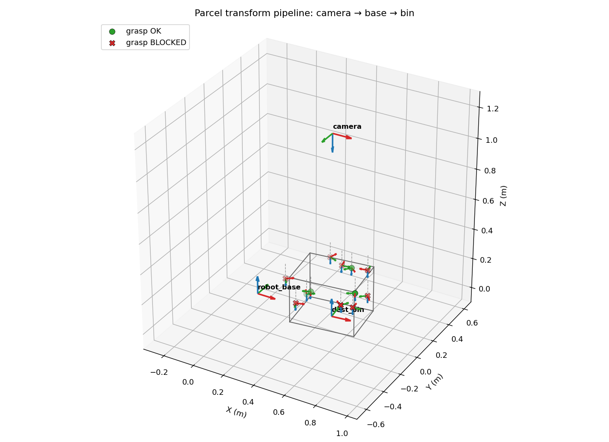

# ParcelTransformPipeline

ParcelTransformPipeline is a small Python project that demonstrates how a
robotic parcel-sorting cell can move detections through a coordinate-frame
pipeline.

The demo simulates parcels detected by a camera, transforms each parcel pose
from the camera frame into the robot base and destination-bin frames, checks
whether the gripper can enter the bin safely, and saves a 3D visualization of
the result.

It uses only NumPy, matplotlib, and pytest. No external robotics libraries are
required.



## Features

- Simulates parcel detections in a camera coordinate frame.
- Uses 4x4 homogeneous transforms for camera, robot-base, and bin frames.
- Applies transforms to a full batch of parcel poses with vectorized NumPy
  matrix operations.
- Checks gripper clearance against the destination bin walls and floor.
- Generates a matplotlib 3D scene showing frames, grasp paths, and clear or
  blocked grasps.
- Includes pytest coverage for transform math and collision edge cases.

## Project Structure

```
ParcelTransformPipeline/
├── main.py                          # runs the full pipeline end to end
├── requirements.txt
├── pyproject.toml                   # pytest configuration
├── pipeline_view.png                # example output image
├── parcel_transform_pipeline/
│   ├── transform.py                 # transform math and RPY helpers
│   ├── frame.py                     # named coordinate frames
│   ├── detection.py                 # parcel detection model and simulator
│   ├── collision.py                 # bin geometry and clearance checks
│   └── visualize.py                 # matplotlib 3D rendering
└── tests/
    ├── test_transform.py
    └── test_collision.py
```

## Requirements

- Python 3.10+
- NumPy
- matplotlib
- pytest

Install dependencies:

```bash
pip install -r requirements.txt
```

## Run the Demo

```bash
python main.py
```

The script prints a per-parcel clearance report and writes a visualization to:

```text
pipeline_view.png
```

Example options:

```bash
python main.py --num 20 --seed 42 --out scene.png
python main.py --seed -1
```

## Run Tests

```bash
pytest
```

## How It Works

1. The project creates three frames: `camera`, `robot_base`, and `dest_bin`.
2. `simulate_detections` generates random parcel positions and orientations in
   the camera frame.
3. The detections are stacked into an `(N, 4, 4)` pose array.
4. `Transform.apply_poses` moves every pose through the transform chain with
   batched NumPy matrix multiplication.
5. `check_grasp_clearance` verifies whether each grasp clears the bin walls,
   rim, and floor.
6. `visualize_pipeline` saves a 3D view of the frames, bin, and grasp paths.

## Key Module: `Transform`

A `Transform` wraps a single 4×4 homogeneous matrix `[[R, t], [0, 1]]` and maps
points from a source frame into a target frame.

- `compose(other)` -> `self.matrix @ other.matrix` (also available as `self @ other`).
- `inverse()` -> closed-form rigid inverse.
- `apply(points)` → transforms `(3,)` or `(N, 3)` points in one matmul.
- `apply_poses(poses)` → left-multiplies a `(N, 4, 4)` pose stack via broadcasting.

Rotations use the **ZYX (yaw-pitch-roll)** convention,
`R = Rz(yaw) · Ry(pitch) · Rx(roll)`, and `rpy_to_rotation` builds whole batches
of rotation matrices at once.
